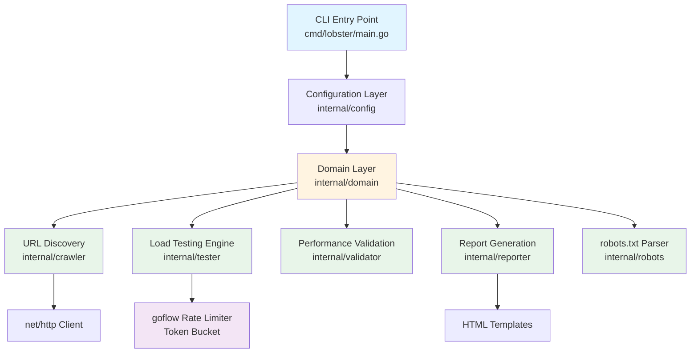
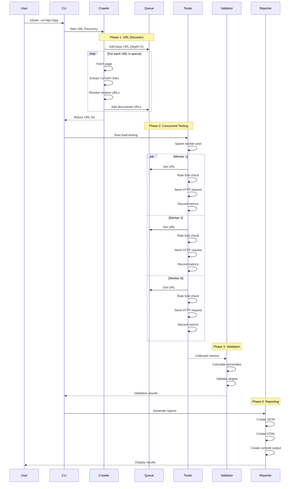

# Architecture

A technical deep-dive into how Lobster works.

## Introduction

Most load testing tools require you to manually specify every endpoint you want to test. Tools like Apache Bench, wrk, and hey excel at hammering a single URL with concurrent requests, but they leave URL discovery entirely to you. Enterprise solutions like JMeter and k6 offer more flexibility but demand significant configuration overhead. This creates a workflow gap: developers want to validate their application's performance under load without spending hours mapping endpoints or writing test scenarios.

Lobster bridges this gap by combining web crawling with concurrent stress testing. Point it at your application's base URL, and it automatically discovers all linked pages, tests them under configurable load, validates performance against targets, and generates actionable reports. This article examines Lobster's architecture, implementation decisions, and practical applications.

## The Problem Space

### Why Another Load Testing Tool?

The load testing landscape offers two extremes:

**Simple single-URL tools** (ab, wrk, hey, vegeta):
- Fast and lightweight
- Perfect for testing a specific endpoint
- Require manual URL enumeration for multi-page applications
- Provide raw metrics without validation logic

**Enterprise testing platforms** (JMeter, k6, Gatling):
- Highly configurable with complex scenario support
- Steep learning curve
- Require test script development
- Often overkill for quick validation during development

**The gap**: Developers needed a tool that could stress test an entire application automatically during development cycles, without requiring test scripts or manual endpoint mapping. This is particularly valuable for:

1. **Pre-deployment validation**: Quickly verify that recent changes haven't introduced performance regressions
2. **Development workflows**: Test the entire application during feature development
3. **CI/CD integration**: Automated performance gates before deployment
4. **Capacity planning**: Understand current performance characteristics

### Design Goals

Lobster was designed with specific constraints:

1. **Zero configuration for basic use**: `lobster -url http://localhost:3000` should just work
2. **Intelligent discovery**: Automatically find all testable endpoints
3. **Validation-focused**: Go beyond raw metrics to provide pass/fail criteria
4. **Multi-format reporting**: Console output for development, JSON for CI/CD, HTML for stakeholders
5. **Respectful behavior**: Honor robots.txt, implement proper rate limiting, handle errors gracefully

## Architecture Overview

Lobster follows Clean Architecture principles with a domain-driven design approach. The system is organized into distinct layers with clear separation of concerns.

### System Components



### Execution Flow

The tool operates in four distinct phases:



### Core Data Flow

```mermaid
flowchart LR
    BaseURL[Base URL] --> Discovery{URL Discovery}
    Discovery --> |Crawl & Parse|URLQueue[(URL Queue<br/>sync.Map)]

    URLQueue --> Distribution{URL Distribution}
    Distribution --> |Round-robin|W1[Worker 1]
    Distribution --> |Round-robin|W2[Worker 2]
    Distribution --> |Round-robin|WN[Worker N]

    W1 --> RateLimiter{Token Bucket<br/>Rate Limiter}
    W2 --> RateLimiter
    WN --> RateLimiter

    RateLimiter --> |Acquire token|HTTP[HTTP Request]
    HTTP --> Metrics[(Metrics Collection<br/>Thread-safe)]

    Metrics --> Analysis{Statistical<br/>Analysis}
    Analysis --> |Calculate|Percentiles[P95/P99<br/>Percentiles]
    Analysis --> |Aggregate|Totals[Request Counts<br/>Success Rate]
    Analysis --> |Identify|Errors[Error Analysis]

    Percentiles --> Validation{Validation}
    Totals --> Validation
    Errors --> Validation

    Validation --> Reports{Report<br/>Generation}
    Reports --> JSON[JSON Output]
    Reports --> HTML[HTML Report]
    Reports --> Console[Console Summary]

    style URLQueue fill:#e3f2fd
    style Metrics fill:#e3f2fd
    style RateLimiter fill:#fff3e0
    style Reports fill:#f3e5f5
```



## Key Implementation Details

### 1. URL Discovery: The Crawler

The crawler is the first phase of execution and arguably the most critical for automation. It must handle various edge cases while maintaining performance.

**Implementation** (internal/crawler/crawler.go):

```go
type Crawler struct {
    baseURL      *url.URL
    discovered   sync.Map        // Thread-safe deduplication
    queue        chan URLTask    // BFS traversal queue
    client       *http.Client
    maxDepth     int
    robotsParser *robots.RobotsData
}

func (c *Crawler) Crawl(ctx context.Context) ([]string, error) {
    // Seed with base URL at depth 0
    c.queue <- domain.URLTask{URL: c.baseURL.String(), Depth: 0}
    c.discovered.Store(c.baseURL.String(), true)

    // BFS traversal with depth limiting
    for {
        select {
        case <-ctx.Done():
            return c.collectResults(), ctx.Err()
        case task := <-c.queue:
            if task.Depth >= c.maxDepth {
                continue
            }
            c.processURL(ctx, task)
        }
    }
}
```

**Key design decisions**:

1. **Breadth-first search**: Ensures shallow pages are discovered first, allowing testing to begin on high-priority pages while deep crawling continues
2. **Depth limiting**: Prevents infinite loops in cyclic link structures and controls memory usage
3. **Same-domain filtering**: Focuses testing on the target application, avoiding external links
4. **robots.txt compliance**: Respects website preferences by default (configurable)

**Link extraction** uses regex for simplicity and performance:

```go
// Pattern: href=["']([^"']+)["']
// Matches: <a href="...">, <a href='...'>
pattern := regexp.MustCompile(`href=["']([^"']+)["']`)
matches := pattern.FindAllStringSubmatch(body, -1)

for _, match := range matches {
    rawURL := match[1]

    // Filter obvious non-HTTP links
    if strings.HasPrefix(rawURL, "javascript:") ||
       strings.HasPrefix(rawURL, "mailto:") ||
       strings.HasPrefix(rawURL, "#") {
        continue
    }

    // Resolve relative URLs
    absoluteURL := c.baseURL.ResolveReference(parsedURL)

    // Same-domain check
    if absoluteURL.Host != c.baseURL.Host {
        continue
    }

    c.enqueueIfNew(absoluteURL.String(), depth+1)
}
```

**Trade-offs**:
- **Regex vs. HTML parser**: Regex is faster for this specific use case (href extraction only) and doesn't require parsing malformed HTML. For complex scenarios (JavaScript-rendered content, shadow DOM), an HTML parser would be necessary.
- **Memory vs. completeness**: Storing all discovered URLs in memory limits scale but ensures complete coverage for typical applications. For very large sites (10,000+ pages), a database-backed queue would be more appropriate.

### 2. Concurrent Testing: The Tester

The tester implements a worker pool pattern with rate limiting to generate realistic load while respecting server capacity.

**Architecture**:

```go
type Tester struct {
    config       *domain.Config
    client       *http.Client
    results      *domain.TestResults
    rateLimiter  *bucket.RateLimiter  // goflow token bucket
    urlQueue     chan string
}

func (t *Tester) Test(ctx context.Context, urls []string) error {
    // Initialize rate limiter: tokens per second with burst capacity
    burst := int(math.Ceil(t.config.Rate * 2))
    t.rateLimiter, _ = bucket.NewSafe(bucket.Limit(t.config.Rate), burst)

    // Populate URL queue for round-robin distribution
    go t.feedURLQueue(ctx, urls)

    // Spawn worker pool
    var wg sync.WaitGroup
    for i := 0; i < t.config.Concurrency; i++ {
        wg.Add(1)
        go t.worker(ctx, &wg)
    }

    wg.Wait()
    return nil
}
```

**Worker implementation**:

```go
func (t *Tester) worker(ctx context.Context, wg *sync.WaitGroup) {
    defer wg.Done()

    for {
        select {
        case <-ctx.Done():
            return
        case url := <-t.urlQueue:
            // Acquire token from rate limiter (blocking)
            if err := t.rateLimiter.Wait(ctx); err != nil {
                return
            }

            // Execute request and collect metrics
            start := time.Now()
            resp, err := t.client.Get(url)
            duration := time.Since(start)

            t.recordMetrics(url, resp, duration, err)
        }
    }
}
```

**Rate limiting deep dive**:

Lobster uses the token bucket algorithm via the [goflow](https://github.com/vnykmshr/goflow) library. This provides smooth rate limiting with burst capacity:

- **Tokens per second**: Set by `-rate` flag (default: 5.0)
- **Burst capacity**: 2x the rate per second
- **Blocking behavior**: Workers wait for tokens, preventing request dropping

Example: `-rate 10` allows 10 requests/second sustained, with bursts up to 20 requests if tokens have accumulated.

**Why token bucket over alternatives**:
- **vs. Fixed window**: Prevents traffic spikes at window boundaries
- **vs. Leaky bucket**: Allows controlled bursts for realistic traffic patterns
- **vs. No limiting**: Prevents overwhelming the server and getting 429 responses

**Thread-safe metrics collection**:

```go
func (t *Tester) recordMetrics(url string, resp *http.Response, duration time.Duration, err error) {
    t.resultsMutex.Lock()
    defer t.resultsMutex.Unlock()

    t.results.TotalRequests++
    t.results.ResponseTimes = append(t.results.ResponseTimes, domain.ResponseTimeEntry{
        Timestamp:    time.Now(),
        ResponseTime: duration,
        URL:          url,
    })

    if err != nil {
        t.results.FailedRequests++
        t.results.Errors = append(t.results.Errors, domain.ErrorInfo{
            Timestamp: time.Now(),
            URL:       url,
            Error:     err.Error(),
        })
        return
    }

    t.results.SuccessfulRequests++
    // Additional status code tracking...
}
```

### 3. Performance Validation

Validation transforms raw metrics into actionable pass/fail criteria. This is what distinguishes Lobster from pure benchmarking tools.

**Percentile calculation**:

```go
func CalculatePercentiles(responseTimes []time.Duration) (p50, p95, p99 time.Duration) {
    if len(responseTimes) == 0 {
        return 0, 0, 0
    }

    // Sort response times
    sorted := make([]time.Duration, len(responseTimes))
    copy(sorted, responseTimes)
    sort.Slice(sorted, func(i, j int) bool {
        return sorted[i] < sorted[j]
    })

    // Calculate percentile indices
    p50Index := int(float64(len(sorted)) * 0.50)
    p95Index := int(float64(len(sorted)) * 0.95)
    p99Index := int(float64(len(sorted)) * 0.99)

    return sorted[p50Index], sorted[p95Index], sorted[p99Index]
}
```

**Target validation logic**:

```go
func Validate(results *domain.TestResults, targets domain.PerformanceTargets) []domain.PerformanceTarget {
    _, p95, p99 := CalculatePercentiles(extractDurations(results.ResponseTimes))

    checks := []domain.PerformanceTarget{
        {
            Name:        "Requests per Second",
            Target:      fmt.Sprintf("≥ %.1f req/s", targets.RequestsPerSecond),
            Actual:      fmt.Sprintf("%.1f req/s", results.RequestsPerSecond),
            Passed:      results.RequestsPerSecond >= targets.RequestsPerSecond,
            Description: "Sustained request throughput",
        },
        {
            Name:        "95th Percentile Response Time",
            Target:      fmt.Sprintf("≤ %.0fms", targets.P95ResponseTimeMs),
            Actual:      fmt.Sprintf("%.1fms", float64(p95.Milliseconds())),
            Passed:      float64(p95.Milliseconds()) <= targets.P95ResponseTimeMs,
            Description: "95% of requests complete within target",
        },
        // Additional checks...
    }

    return checks
}
```

**Default targets** are designed for typical web applications:

```go
func DefaultPerformanceTargets() PerformanceTargets {
    return PerformanceTargets{
        RequestsPerSecond:   100,    // Moderate throughput
        AvgResponseTimeMs:   50,     // Snappy response
        P95ResponseTimeMs:   100,    // Acceptable tail latency
        P99ResponseTimeMs:   200,    // Maximum acceptable latency
        SuccessRate:         99.0,   // High reliability
        ErrorRate:           1.0,    // Low error tolerance
    }
}
```

These can be customized via configuration file for specific application requirements.

### 4. Multi-Format Reporting

Lobster generates three report formats, each serving different use cases:

**Console output** for development:

```
=== STRESS TEST RESULTS ===
Duration: 2m0s
URLs Discovered: 42
Total Requests: 2,450
Successful Requests: 2,442
Failed Requests: 8
Average Response Time: 18.7ms
Requests/Second: 20.4
Success Rate: 99.67%

🎯 PERFORMANCE TARGET VALIDATION
============================================================
✅ PASS Requests per Second:         20.4 req/s
✅ PASS Average Response Time:        18.7ms
✅ PASS 95th Percentile Response Time: 35.2ms
✅ PASS Success Rate:                 99.67%

Overall: 4/4 targets met (100.0%)
🎉 ALL PERFORMANCE TARGETS MET!
```

**JSON output** for CI/CD integration:

```json
{
  "duration": "2m0s",
  "urls_discovered": 42,
  "total_requests": 2450,
  "performance_validation": {
    "targets_met": 4,
    "total_targets": 4,
    "overall_status": "PRODUCTION_READY",
    "checks": [...]
  },
  "url_validations": [...],
  "errors": [...],
  "slow_requests": [...]
}
```

**HTML report** for stakeholders:
- Overview dashboard with key metrics
- Interactive charts (response time distribution, status codes)
- Sortable table of all tested URLs
- Error analysis with actionable recommendations

The HTML report uses embedded CSS and JavaScript (Chart.js via CDN) for portability—a single file contains everything needed for viewing.

## Real-World Applications

### Use Case 1: Pre-Deployment Validation

**Scenario**: A team is deploying a new feature that modifies database queries. They want to ensure no performance regressions were introduced.

**Workflow**:
```bash
# Start local application with production-like data
./start-local.sh

# Run Lobster with production-like targets
lobster -url http://localhost:3000 \
  -duration 5m \
  -concurrency 20 \
  -rate 10 \
  -config production-targets.json

# Check exit code
if [ $? -eq 0 ]; then
  echo "Performance validation passed"
else
  echo "Performance regression detected"
  exit 1
fi
```

**Configuration** (production-targets.json):
```json
{
  "performance_targets": {
    "requests_per_second": 50,
    "avg_response_time_ms": 100,
    "p95_response_time_ms": 200,
    "success_rate": 99.5
  }
}
```

### Use Case 2: CI/CD Integration

**GitHub Actions workflow**:

```yaml
name: Performance Tests

on: [pull_request]

jobs:
  performance:
    runs-on: ubuntu-latest

    steps:
      - uses: actions/checkout@v4

      - name: Start application
        run: |
          docker-compose up -d
          ./scripts/wait-for-app.sh

      - name: Install Lobster
        run: go install github.com/vnykmshr/lobster/cmd/lobster@latest

      - name: Run stress tests
        run: |
          lobster -url http://localhost:3000 \
            -duration 3m \
            -output results.json

      - name: Upload results
        uses: actions/upload-artifact@v4
        if: always()
        with:
          name: performance-results
          path: results.json

      - name: Comment PR
        uses: actions/github-script@v7
        if: always()
        with:
          script: |
            const fs = require('fs');
            const results = JSON.parse(fs.readFileSync('results.json'));
            const status = results.performance_validation.overall_status;
            const comment = `## Performance Test Results\n\n` +
              `Status: ${status}\n` +
              `Requests: ${results.total_requests}\n` +
              `Success Rate: ${results.success_rate}%\n` +
              `Avg Response Time: ${results.average_response_time}`;
            github.rest.issues.createComment({
              issue_number: context.issue.number,
              owner: context.repo.owner,
              repo: context.repo.repo,
              body: comment
            });
```

### Use Case 3: Capacity Planning

**Scenario**: Understanding current application limits before scaling.

**Progressive load testing**:

```bash
# Test at increasing concurrency levels
for concurrency in 5 10 20 50 100; do
  echo "Testing with $concurrency workers..."
  lobster -url http://staging.example.com \
    -duration 10m \
    -concurrency $concurrency \
    -rate 10 \
    -output "results-c${concurrency}.json"

  # Extract key metrics
  jq '.requests_per_second, .success_rate' "results-c${concurrency}.json"
done
```

**Analysis**: Plot throughput vs. concurrency to identify bottlenecks and optimal worker count.

## Design Decisions and Trade-offs

### 1. Why Go?

**Chosen advantages**:
- Excellent concurrency primitives (goroutines, channels, sync package)
- Fast compilation and single-binary deployment
- Strong standard library for HTTP and networking
- Good performance for I/O-bound workloads

**Alternatives considered**:
- **Python**: Easier HTML parsing but poorer concurrency story
- **Rust**: Better performance but higher development complexity
- **Node.js**: Good for async I/O but less suitable for CPU-intensive percentile calculations

### 2. Why Clean Architecture?

**Benefits realized**:
- Clear separation allows independent testing of crawler, tester, validator
- Easy to extend (e.g., adding GraphQL support would be a new crawler implementation)
- Domain models are reusable across different interfaces (CLI today, API server tomorrow)

**Costs**:
- More files and indirection than a monolithic approach
- Possibly over-engineered for current scope (~1,000 LOC)

**Verdict**: Worth it for maintainability and future extensions.

### 3. In-Memory URL Storage

**Current approach**: All discovered URLs stored in `sync.Map`

**Limitations**:
- Memory usage grows with URL count (~1KB per URL)
- Unsuitable for very large sites (10,000+ pages)

**Alternatives for future**:
- SQLite for large crawls
- Redis for distributed crawling
- Streaming approach (test as you discover)

**Current reasoning**: Simplicity and performance for the target use case (typical web applications with hundreds to low thousands of pages).

### 4. Synchronous Crawling

**Current approach**: Crawl phase completes before testing phase begins

**Benefits**:
- Simpler implementation
- Easier to estimate test duration
- Complete URL list available for reporting

**Alternative**: Stream discovered URLs to testing queue

**Benefits of streaming**:
- Faster time to first test
- Lower memory footprint
- Can begin testing high-priority pages immediately

**Trade-off decision**: Synchronous approach chosen for v1.0 due to simpler error handling and clearer user experience. Streaming mode could be added as an option in future versions.

## Performance Characteristics

### Benchmarks

**Test environment**: MacBook Pro M1, 16GB RAM, testing against local Nginx serving static HTML

**Crawler performance**:
- 100 URLs: ~2 seconds
- 1,000 URLs: ~20 seconds
- 5,000 URLs: ~95 seconds (bottleneck: network I/O)

**Tester performance** (after URL discovery):
- 5 workers, 5 req/s: Smooth, no dropped requests
- 50 workers, 50 req/s: Smooth, <1% CPU usage
- 100 workers, 100 req/s: 429 errors on test server

**Memory usage**:
- Base: ~10MB
- With 1,000 URLs: ~15MB
- With 10,000 URLs: ~45MB

### Optimization Opportunities

**1. Crawler parallelization**: Current single-threaded crawler could spawn multiple workers

```go
// Current: Sequential
for task := range queue {
    c.processURL(task)
}

// Potential: Parallel with worker pool
for i := 0; i < crawlerWorkers; i++ {
    go func() {
        for task := range queue {
            c.processURL(task)
        }
    }()
}
```

**2. Response body sampling**: Currently reads up to 64KB for link extraction

```go
// Potential optimization: Stream and stop at first N links
body := http.MaxBytesReader(nil, resp.Body, 64*1024)
```

**3. HTML parsing**: Regex is fast but misses edge cases. For complex pages:

```go
import "golang.org/x/net/html"

func extractLinks(body io.Reader) []string {
    doc, _ := html.Parse(body)
    return traverseForLinks(doc)
}
```

## When to Use Lobster

### Good Fit

- **Development workflows**: Quick validation during feature development
- **Small to medium web applications**: Up to a few thousand pages
- **Pre-deployment smoke tests**: Automated in CI/CD pipelines
- **Regression testing**: Ensure performance doesn't degrade over time
- **API endpoint discovery**: REST APIs with hypermedia links

### Not a Good Fit

- **JavaScript-heavy SPAs**: Lobster parses static HTML; it won't execute JavaScript
- **Extremely large sites**: 10,000+ pages may be slow and memory-intensive
- **Complex authentication flows**: v1.0 doesn't support authentication (planned for v0.4+)
- **Production load testing**: Use dedicated solutions with distributed workers
- **Precise latency measurements**: Not a replacement for dedicated APM tools

## Conclusion

Lobster demonstrates that there's value in the space between simple single-URL load testing tools and complex enterprise solutions. By focusing on automation (crawler-first design), validation (pass/fail criteria), and developer experience (zero-config defaults), it addresses a specific workflow gap in the testing toolkit.

The implementation choices—Clean Architecture, token bucket rate limiting, multi-format reporting—prioritize maintainability and extensibility over raw performance. This positions Lobster well for future enhancements like authentication support, distributed testing, and real-time result streaming.

The tool is most effective as part of a continuous integration pipeline, providing automated performance validation before deployments. While it won't replace dedicated monitoring solutions or distributed load testing platforms, it fills a valuable niche for rapid, automated performance validation during development and in CI/CD workflows.

---

**Project**: [github.com/vnykmshr/lobster](https://github.com/vnykmshr/lobster)
**Version**: 1.0.0
**License**: MIT
**Author**: @vnykmshr
